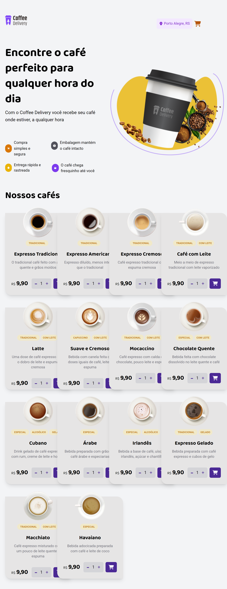

<h1 align="center">Coffee Delivery</h1>

  <a href="#-tecnologias">Tecnologias</a>&nbsp;&nbsp;&nbsp;|&nbsp;&nbsp;&nbsp;
  <a href="#-projeto">Projeto</a>&nbsp;&nbsp;&nbsp;|&nbsp;&nbsp;&nbsp;
  <a href="#memo-licença">Licença</a>

  

 

  

## 🚀 Tecnologias Utilizadas

Esse projeto foi desenvolvido com as seguintes tecnologias:

- React: Biblioteca JavaScript para a construção de interfaces de usuário.
- TypeScript: Superset da linguagem JavaScript que adiciona tipagem estática.
- Tailwind CSS: Framework de estilização CSS.
- Redux: Biblioteca para gerenciamento de estado.
- Axios: Cliente HTTP baseado em Promises.
- React-Toastify: Biblioteca para exibir notificações toast no React.
- Vite: Ferramenta de build rápida para projetos baseados em JavaScript.

## 📑 Estrutura do Projeto

- A estrutura do projeto está organizada da seguinte forma:

- src/components: Componentes React reutilizáveis.
- src/pages: Páginas principais do aplicativo.
- src/store: Configuração e definições do Redux.

## 💻 Projeto

O Coffee Delivery é uma plataforma de entrega de café que facilita a seleção e o pedido de produtos. Você pode adicionar itens ao carrinho, ajustar a quantidade, confirmar o pedido e inserir dados de entrega.

## ⚙️ Funcionalidades

- Adicionar e Remover Itens: Permite adicionar itens ao carrinho e remover itens existentes.
- Ajuste de Quantidade: Você pode aumentar ou diminuir a quantidade de cada item no carrinho.
- Confirmação de Pedido: Após revisar o carrinho, você pode confirmar o pedido e inserir dados de entrega.
- Estilização Responsiva: Utiliza Tailwind CSS para uma experiência visual moderna e adaptável.
- Gerenciamento de Estado Centralizado: Utiliza Redux para gerenciar o estado global da aplicação.

## ❣️ Contribuição

Fique à vontade para contribuir com melhorias, correções de bugs ou novas funcionalidades. Abra uma issue para discutir ideias e sugestões, ou envie um pull request.

Esperamos que esta plataforma torne a sua experiência de pedido de café mais conveniente e agradável. Se tiver alguma dúvida ou sugestão, não hesite em entrar em contato. Aproveite o serviço!

## :memo: Licença

Esse projeto está sob a licença MIT.

---

Feito com ♥ by Gabriel fellipe :wave:
